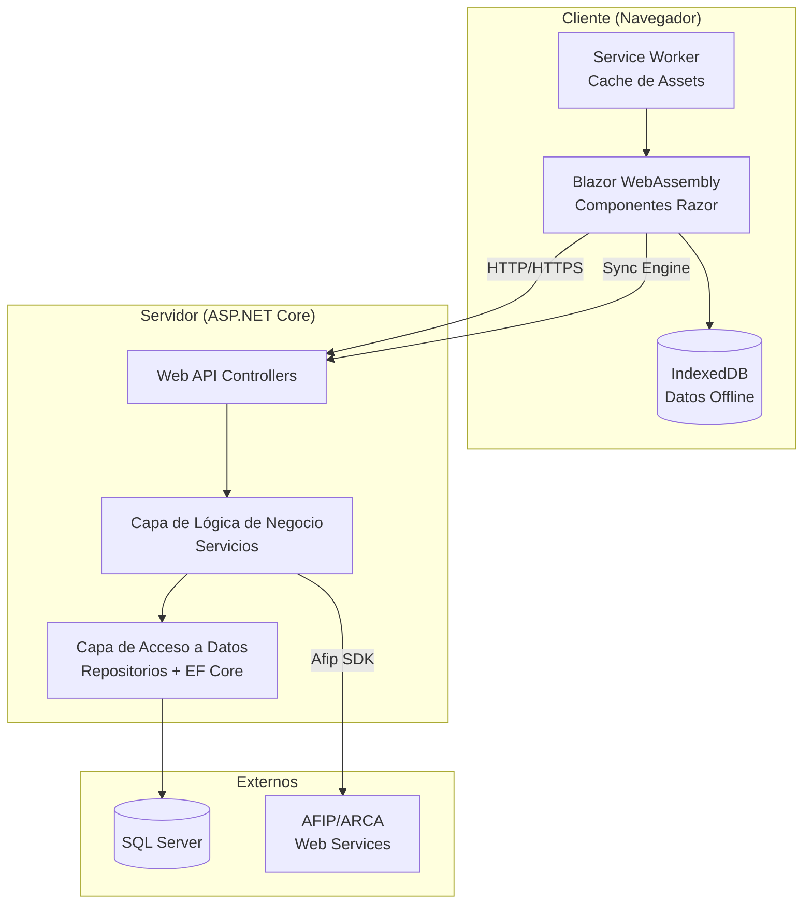
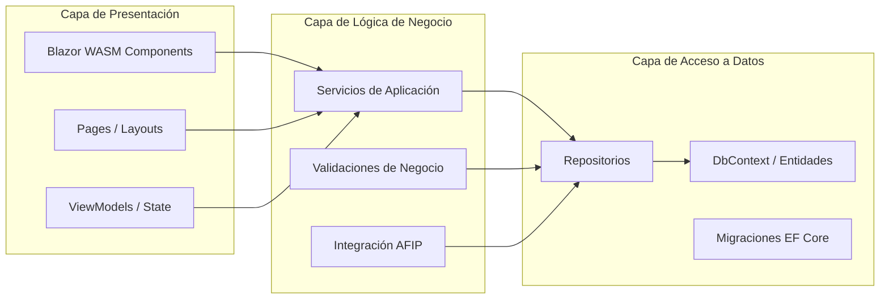
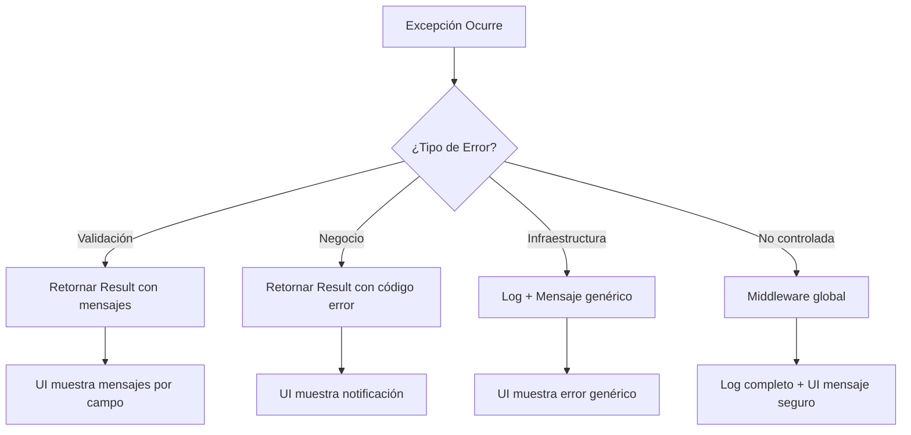

# Design Document

## Overview

El Sistema POS es una aplicación web progresiva (PWA) construida con ASP.NET Core y Blazor WebAssembly que permite la gestión integral de un punto de venta: productos, categorías, usuarios, ventas, caja, facturación electrónica AFIP y reportes. La arquitectura sigue un modelo de capas con separación estricta de responsabilidades, soporte offline mediante IndexedDB y sincronización automática al recuperar conectividad.

### Decisiones de Diseño Principales

| Decisión | Justificación |
|----------|---------------|
| Blazor WebAssembly (PWA) | Permite ejecución offline en el navegador, cache de assets via Service Worker y acceso a IndexedDB para almacenamiento local |
| ASP.NET Core Web API como backend | Separación clara entre frontend y backend, facilita testing independiente y escalabilidad |
| Entity Framework Core Code First | Generación del schema desde código, migraciones versionadas, validaciones a nivel de modelo |
| SQL Server | Motor relacional robusto, soporte de transacciones ACID, integridad referencial nativa |
| Afip SDK (NuGet Afip.Net) | Abstrae la complejidad de los Web Services SOAP de AFIP/ARCA para facturación electrónica |
| IndexedDB (via JS Interop) | Almacenamiento estructurado en el navegador para operaciones offline |

---

## Architecture

### Diagrama de Arquitectura de Alto Nivel



### Diagrama de Capas (Layered Architecture)



### Estructura de Solución (.sln)

```
SistemaAlmacen.sln
│
├── src/
│   ├── SistemaAlmacen.Client/           # Blazor WebAssembly (PWA)
│   │   ├── Pages/
│   │   ├── Components/
│   │   ├── Services/                    # Servicios HTTP del cliente
│   │   ├── Offline/                     # Motor de sincronización e IndexedDB
│   │   ├── wwwroot/
│   │   │   ├── service-worker.js
│   │   │   └── manifest.json
│   │   └── Program.cs
│   │
│   ├── SistemaAlmacen.Server/           # ASP.NET Core Web API
│   │   ├── Controllers/
│   │   ├── Middleware/
│   │   ├── Filters/
│   │   └── Program.cs
│   │
│   ├── SistemaAlmacen.Business/         # Lógica de Negocio
│   │   ├── Services/
│   │   ├── Validators/
│   │   ├── Interfaces/
│   │   └── DTOs/
│   │
│   ├── SistemaAlmacen.Data/             # Acceso a Datos
│   │   ├── Context/
│   │   ├── Entities/
│   │   ├── Repositories/
│   │   ├── Configurations/             # Fluent API configs
│   │   └── Migrations/
│   │
│   └── SistemaAlmacen.Shared/           # Modelos compartidos Client/Server
│       ├── DTOs/
│       ├── Enums/
│       └── Validators/                  # Data Annotations compartidas
│
└── tests/
    ├── SistemaAlmacen.Business.Tests/
    ├── SistemaAlmacen.Data.Tests/
    └── SistemaAlmacen.Integration.Tests/
```

### Flujo de Dependencias

```
Client → Shared
Server → Business → Data → Shared
Server → Shared
```

Las dependencias fluyen unidireccionalmente: Presentación → Negocio → Datos. No hay referencias inversas.

---

## Components and Interfaces

### 1. Módulo de Autenticación

```csharp
public interface IAuthService
{
    Task<AuthResult> LoginAsync(LoginRequest request);
    Task LogoutAsync();
    Task<bool> RequestPasswordRecoveryAsync(string email);
    Task<bool> ResetPasswordAsync(string token, string newPassword);
    Task<bool> ValidateRecoveryTokenAsync(string token);
}

public interface ITokenService
{
    string GenerateJwtToken(Usuario usuario);
    string GenerateRecoveryToken();
    ClaimsPrincipal ValidateToken(string token);
}

public interface ISessionService
{
    Task<bool> IsSessionActiveAsync(string userId);
    Task InvalidateSessionAsync(string userId);
    Task RecordLoginAttemptAsync(string email, bool success);
    Task<bool> IsAccountLockedAsync(string email);
}
```

### 2. Módulo de Usuarios

```csharp
public interface IUsuarioService
{
    Task<PaginatedResult<UsuarioDto>> GetUsuariosAsync(UsuarioFilter filter);
    Task<UsuarioDto> GetByIdAsync(int id);
    Task<Result<UsuarioDto>> CreateAsync(CreateUsuarioRequest request);
    Task<Result<UsuarioDto>> UpdateAsync(int id, UpdateUsuarioRequest request);
    Task<Result> DeactivateAsync(int id, int currentUserId);
    Task<PaginatedResult<UsuarioDto>> SearchAsync(string term, int page, int pageSize);
}
```

### 3. Módulo de Productos y Categorías

```csharp
public interface ICategoriaService
{
    Task<List<CategoriaDto>> GetAllAsync();
    Task<Result<CategoriaDto>> CreateAsync(CreateCategoriaRequest request);
    Task<Result<CategoriaDto>> UpdateAsync(int id, UpdateCategoriaRequest request);
    Task<Result> DeleteAsync(int id);
}

public interface IProductoService
{
    Task<PaginatedResult<ProductoDto>> GetProductosAsync(ProductoFilter filter);
    Task<ProductoDto> GetByIdAsync(int id);
    Task<Result<ProductoDto>> CreateAsync(CreateProductoRequest request);
    Task<Result<ProductoDto>> UpdateAsync(int id, UpdateProductoRequest request);
    Task<Result> DeactivateAsync(int id);
    Task<PaginatedResult<ProductoDto>> SearchAsync(string term, int page, int pageSize);
}
```

### 4. Módulo de Ventas

```csharp
public interface IVentaService
{
    Task<VentaDto> InitializeVentaAsync(int vendedorId);
    Task<Result<DetalleVentaDto>> AddDetalleAsync(int ventaId, AddDetalleRequest request);
    Task<Result> RemoveDetalleAsync(int ventaId, int detalleId);
    Task<Result<VentaConfirmadaDto>> ConfirmVentaAsync(int ventaId, ConfirmVentaRequest request);
    Task<PaginatedResult<VentaResumenDto>> GetHistorialAsync(VentaFilter filter);
    Task<VentaDetalleCompletoDto> GetDetalleCompletoAsync(int ventaId);
}

public interface IStockService
{
    Task<bool> HasSufficientStockAsync(int productoId, int cantidad);
    Task<Result> DeductStockAsync(List<StockDeduction> deductions);
}
```

### 5. Módulo de Caja

```csharp
public interface ICajaService
{
    Task<Result<CajaDto>> AbrirCajaAsync(AbrirCajaRequest request);
    Task<Result<CierreResumenDto>> CerrarCajaAsync(CerrarCajaRequest request);
    Task<Result<MovimientoDto>> RegistrarRetiroAsync(MovimientoRequest request);
    Task<Result<MovimientoDto>> RegistrarIngresoAsync(MovimientoRequest request);
    Task<CajaDto?> GetCajaAbiertaAsync(int puntoDeVentaId);
    Task<PaginatedResult<CierreResumenDto>> GetHistorialCierresAsync(CierreFilter filter);
}
```

### 6. Módulo de Facturación AFIP

```csharp
public interface IFacturacionService
{
    Task<Result<ComprobanteDto>> EmitirComprobanteAsync(int ventaId);
    Task<Result<ComprobanteDto>> ReintentarEmisionAsync(int ventaId);
    Task<List<VentaPendienteFacturacionDto>> GetPendientesAsync();
    Task<Result> EmitirPendientesMasivamenteAsync();
    Task<ComprobanteInfoDto> ConsultarComprobanteAsync(int ventaId);
    Task<byte[]> GenerarPdfComprobanteAsync(int ventaId);
}

public interface IAfipClientWrapper
{
    Task<AfipVoucherResponse> CreateNextVoucherAsync(AfipVoucherRequest request);
    Task<AfipVoucherInfo> GetVoucherInfoAsync(int puntoDeVenta, int tipoComprobante, long numero);
}
```

### 7. Módulo de Reportes

```csharp
public interface IReporteService
{
    Task<ReporteVentasDto> GenerarReporteVentasAsync(DateTime fechaInicio, DateTime fechaFin);
    Task<List<ProductoMasVendidoDto>> GenerarReporteProductosAsync(DateTime fechaInicio, DateTime fechaFin);
    Task<List<ReporteInventarioDto>> GenerarReporteInventarioAsync();
    Task<byte[]> ExportarAsync(ExportRequest request);
}

public enum FormatoExportacion
{
    PDF,
    Excel,
    CSV
}
```

### 8. Módulo de Auditoría

```csharp
public interface IAuditoriaService
{
    Task RegistrarOperacionAsync(AuditoriaEntry entry);
    Task<PaginatedResult<AuditoriaDto>> GetHistorialAsync(AuditoriaFilter filter);
}

public interface IAuditoriaInterceptor
{
    // Se registra como interceptor de EF Core SaveChanges
    void OnBeforeSaveChanges(DbContext context);
    void OnAfterSaveChanges(DbContext context, List<AuditEntry> entries);
}
```

### 9. Módulo de Medios de Pago

```csharp
public interface IMedioPagoService
{
    Task<List<MedioPagoDto>> GetActivosAsync();
    Task<List<MedioPagoDto>> GetAllAsync();
    Task<Result<MedioPagoDto>> CreateAsync(CreateMedioPagoRequest request);
    Task<Result<MedioPagoDto>> UpdateAsync(int id, UpdateMedioPagoRequest request);
    Task<Result> DeactivateAsync(int id);
}
```

### 10. Motor de Sincronización Offline

```csharp
// Ejecuta en el cliente (Blazor WASM)
public interface ISyncEngine
{
    Task<SyncStatus> GetStatusAsync();
    Task SyncPendingOperationsAsync();
    Task<int> GetPendingCountAsync();
    event EventHandler<SyncStatusChangedEventArgs> StatusChanged;
}

public interface IOfflineStorageService
{
    Task StoreVentaOfflineAsync(VentaOfflineDto venta);
    Task<List<VentaOfflineDto>> GetPendingVentasAsync();
    Task RemoveVentaAsync(string localId);
    Task CacheProductosAsync(List<ProductoDto> productos);
    Task<List<ProductoDto>> GetCachedProductosAsync();
}

public interface IConnectivityService
{
    bool IsOnline { get; }
    event EventHandler<ConnectivityChangedEventArgs> ConnectivityChanged;
}
```

---

## Data Models

### Diagrama Entidad-Relación

```mermaid
erDiagram
    Usuario ||--o{ Venta : "registra"
    Usuario ||--o{ AuditoriaLog : "ejecuta"
    Usuario ||--o{ CajaMovimiento : "realiza"
    Categoria ||--o{ Producto : "agrupa"
    Producto ||--o{ DetalleVenta : "incluido en"
    Venta ||--|{ DetalleVenta : "contiene"
    Venta ||--|{ VentaPago : "pagada con"
    Venta ||--o| Comprobante : "facturada como"
    MedioPago ||--o{ VentaPago : "utilizado en"
    Caja ||--o{ CajaMovimiento : "registra"

    Usuario {
        int Id PK
        string Nombre
        string Email
        string PasswordHash
        Rol Rol
        bool Activo
        int IntentosFallidos
        DateTime? BloqueadoHasta
        DateTime FechaCreacion
    }

    Categoria {
        int Id PK
        string Nombre
        string Descripcion
        DateTime FechaCreacion
    }

    Producto {
        int Id PK
        string Nombre
        string Descripcion
        decimal Precio
        int Stock
        int CategoriaId FK
        bool Activo
        DateTime FechaCreacion
        DateTime FechaModificacion
    }

    Venta {
        int Id PK
        int UsuarioId FK
        DateTime Fecha
        decimal Total
        EstadoVenta Estado
        DateTime FechaCreacion
    }

    DetalleVenta {
        int Id PK
        int VentaId FK
        int ProductoId FK
        int Cantidad
        decimal PrecioUnitario
        decimal Subtotal
    }

    VentaPago {
        int Id PK
        int VentaId FK
        int MedioPagoId FK
        decimal Monto
    }

    MedioPago {
        int Id PK
        string Nombre
        bool Activo
        bool EsSistema
    }

    Comprobante {
        int Id PK
        int VentaId FK
        int TipoComprobante
        long NumeroComprobante
        string CAE
        DateTime FechaVencimientoCAE
        EstadoComprobante Estado
        string ErrorDetalle
        DateTime FechaEmision
    }

    Caja {
        int Id PK
        int PuntoDeVentaId
        int UsuarioAperturaId FK
        int UsuarioCierreId FK
        decimal MontoInicial
        decimal MontoRealCierre
        decimal SaldoEsperado
        decimal Diferencia
        EstadoCaja Estado
        DateTime FechaApertura
        DateTime FechaCierre
    }

    CajaMovimiento {
        int Id PK
        int CajaId FK
        int UsuarioId FK
        TipoMovimiento Tipo
        decimal Monto
        string Motivo
        DateTime Fecha
    }

    AuditoriaLog {
        long Id PK
        int UsuarioId FK
        TipoOperacion TipoOperacion
        string EntidadAfectada
        string RegistroAfectadoId
        string Descripcion
        DateTime Fecha
    }

    TokenRecuperacion {
        int Id PK
        int UsuarioId FK
        string Token
        bool Usado
        DateTime FechaCreacion
        DateTime FechaExpiracion
    }
```

### Enumeraciones

```csharp
public enum Rol { Administrador = 1, Vendedor = 2 }

public enum EstadoVenta { Borrador = 1, Confirmada = 2, PendienteFacturacion = 3 }

public enum EstadoComprobante { Emitido = 1, Pendiente = 2, Rechazado = 3 }

public enum EstadoCaja { Abierta = 1, Cerrada = 2 }

public enum TipoMovimiento { Apertura = 1, VentaEfectivo = 2, Retiro = 3, IngresoAdicional = 4 }

public enum TipoOperacion { Creacion = 1, Modificacion = 2, Eliminacion = 3, Venta = 4, Anulacion = 5 }

public enum TipoComprobante { FacturaA = 1, FacturaB = 6, FacturaC = 11 }

public enum FormatoExportacion { PDF = 1, Excel = 2, CSV = 3 }
```

### Configuración Entity Framework (Fluent API) — Ejemplo Venta

```csharp
public class VentaConfiguration : IEntityTypeConfiguration<Venta>
{
    public void Configure(EntityTypeBuilder<Venta> builder)
    {
        builder.HasKey(v => v.Id);
        builder.Property(v => v.Total).HasPrecision(18, 2);
        builder.Property(v => v.Estado).IsRequired();
        
        builder.HasOne(v => v.Usuario)
            .WithMany(u => u.Ventas)
            .HasForeignKey(v => v.UsuarioId)
            .OnDelete(DeleteBehavior.Restrict);

        builder.HasMany(v => v.Detalles)
            .WithOne(d => d.Venta)
            .HasForeignKey(d => d.VentaId)
            .OnDelete(DeleteBehavior.Cascade);
    }
}
```

### Restricciones de Integridad Clave

| Relación | Comportamiento en Eliminación |
|----------|-------------------------------|
| Venta → Usuario | RESTRICT (no se puede eliminar usuario con ventas) |
| DetalleVenta → Producto | RESTRICT (no se puede eliminar producto con ventas) |
| Venta → DetalleVenta | CASCADE (eliminar venta elimina detalles) |
| Producto → Categoría | RESTRICT (no se puede eliminar categoría con productos) |
| VentaPago → MedioPago | RESTRICT |
| CajaMovimiento → Caja | CASCADE |

---

## Correctness Properties

*Una propiedad es una característica o comportamiento que debe mantenerse verdadero en todas las ejecuciones válidas de un sistema — esencialmente, una declaración formal sobre lo que el sistema debe hacer. Las propiedades sirven como puente entre especificaciones legibles por humanos y garantías de correctitud verificables por máquina.*

### Property 1: Total de venta es suma de subtotales

*Para cualquier* venta con uno o más detalles, el total de la venta DEBE ser igual a la suma de todos los subtotales de sus detalles, donde cada subtotal es precio unitario × cantidad.

**Validates: Requirements 9.4**

### Property 2: Subtotal es precio por cantidad

*Para cualquier* detalle de venta con precio unitario válido (0.01 a 999,999,999.99) y cantidad válida (1 a 10,000), el subtotal DEBE ser exactamente igual al producto de precio unitario × cantidad.

**Validates: Requirements 9.2**

### Property 3: Stock no puede ser negativo tras venta

*Para cualquier* producto con stock S y una venta que solicita cantidad C donde C ≤ S, tras confirmar la venta el stock resultante DEBE ser S - C (≥ 0). Si C > S, la venta DEBE ser rechazada.

**Validates: Requirements 9.3, 9.5**

### Property 4: Validación de entrada rechaza whitespace y vacíos

*Para cualquier* cadena compuesta enteramente de caracteres de espacio en blanco (o vacía), los validadores de nombre de usuario, nombre de producto, nombre de categoría y descripción de tarea DEBEN rechazar la entrada.

**Validates: Requirements 3.9, 7.1, 8.1, 12.2**

### Property 5: Unicidad de email de usuario activo

*Para cualquier* par de usuarios activos en el sistema, sus correos electrónicos DEBEN ser distintos (case-insensitive). Intentar crear un usuario con un email ya existente en un usuario activo DEBE ser rechazado.

**Validates: Requirements 3.6**

### Property 6: Eliminación lógica excluye de listados

*Para cualquier* entidad marcada como inactiva (usuario o producto), esa entidad NO DEBE aparecer en los resultados de listados ni búsquedas normales.

**Validates: Requirements 3.4, 8.4**

### Property 7: Pago mixto debe igualar el total

*Para cualquier* venta con total T y un conjunto de pagos P₁, P₂, ..., Pₙ asignados a medios de pago, la suma P₁ + P₂ + ... + Pₙ DEBE ser exactamente igual a T para que la confirmación sea aceptada.

**Validates: Requirements 17.6, 17.7**

### Property 8: Saldo esperado de caja es monto inicial + ingresos - retiros

*Para cualquier* caja con monto inicial M, ingresos en efectivo por ventas Σv, ingresos adicionales Σi, y retiros Σr, el saldo esperado DEBE ser M + Σv + Σi - Σr.

**Validates: Requirements 16.6, 16.7**

### Property 9: Búsqueda parcial case-insensitive retorna coincidencias correctas

*Para cualquier* término de búsqueda T y conjunto de productos activos, todos los resultados retornados DEBEN contener T como subcadena de su nombre o categoría (ignorando mayúsculas/minúsculas), y ningún producto activo que contenga T DEBE ser omitido.

**Validates: Requirements 8.5, 3.5**

### Property 10: Auditoría es inmutable y completa

*Para cualquier* operación significativa (creación, modificación, eliminación de usuario/producto/categoría, registro/anulación de venta), DEBE existir un registro de auditoría correspondiente. Los registros de auditoría NO DEBEN poder ser modificados ni eliminados.

**Validates: Requirements 13.1, 13.7**

### Property 11: Round-trip de serialización offline

*Para cualquier* venta registrada offline, al serializar a IndexedDB y deserializar de vuelta, los datos (productos, cantidades, precios, fecha, vendedor) DEBEN ser idénticos al estado original.

**Validates: Requirements 14.2, 14.6**

### Property 12: Roles restringen acceso correctamente

*Para cualquier* usuario con rol Vendedor y cualquier funcionalidad restringida a Administrador (gestión de usuarios, gestión de categorías de escritura, reportes globales, auditoría), el acceso DEBE ser denegado tanto a nivel de UI (ocultando opciones) como a nivel de servidor (retornando 403).

**Validates: Requirements 6.3, 6.4, 6.5**

### Property 13: Token de recuperación de un solo uso

*Para cualquier* token de recuperación de contraseña, tras ser utilizado exitosamente una vez, cualquier intento posterior de uso DEBE ser rechazado. Tokens expirados (>24h) DEBEN ser rechazados independientemente de si fueron usados.

**Validates: Requirements 5.4, 5.5, 5.6**

---

## Error Handling

### Estrategia Global



### Patrón Result para Operaciones de Negocio

```csharp
public class Result
{
    public bool IsSuccess { get; }
    public string? ErrorMessage { get; }
    public string? ErrorCode { get; }
    public Dictionary<string, string[]>? FieldErrors { get; }
    
    public static Result Success() => new(true);
    public static Result Failure(string message, string? code = null) => new(false, message, code);
    public static Result ValidationFailure(Dictionary<string, string[]> errors) => new(false, errors);
}

public class Result<T> : Result
{
    public T? Value { get; }
    public static Result<T> Success(T value) => new(value);
}
```

### Middleware de Manejo de Excepciones

```csharp
public class GlobalExceptionMiddleware : IMiddleware
{
    public async Task InvokeAsync(HttpContext context, RequestDelegate next)
    {
        try
        {
            await next(context);
        }
        catch (ValidationException ex)
        {
            context.Response.StatusCode = 400;
            await context.Response.WriteAsJsonAsync(new ErrorResponse(ex.Errors));
        }
        catch (UnauthorizedException ex)
        {
            context.Response.StatusCode = 403;
            await context.Response.WriteAsJsonAsync(new ErrorResponse("Permisos insuficientes"));
        }
        catch (DbUpdateException ex)
        {
            _logger.LogError(ex, "Error de base de datos");
            context.Response.StatusCode = 500;
            await context.Response.WriteAsJsonAsync(
                new ErrorResponse("La operación no pudo completarse. Intente nuevamente."));
        }
        catch (Exception ex)
        {
            _logger.LogError(ex, "Error no controlado");
            context.Response.StatusCode = 500;
            await context.Response.WriteAsJsonAsync(
                new ErrorResponse("Ha ocurrido un error inesperado."));
        }
    }
}
```

### Manejo de Transacciones (Ventas)

```csharp
public async Task<Result<VentaConfirmadaDto>> ConfirmVentaAsync(int ventaId, ConfirmVentaRequest request)
{
    await using var transaction = await _context.Database.BeginTransactionAsync();
    try
    {
        // 1. Validar stock disponible para todos los items
        // 2. Descontar stock atómicamente
        // 3. Registrar pagos
        // 4. Marcar venta como confirmada
        // 5. Registrar movimiento de caja (si hay pago en efectivo)
        
        await _context.SaveChangesAsync();
        await transaction.CommitAsync();
        
        // 6. Intentar emisión de comprobante AFIP (asíncrono, no bloquea)
        _ = _facturacionService.EmitirComprobanteAsync(ventaId);
        
        return Result<VentaConfirmadaDto>.Success(dto);
    }
    catch (DbUpdateConcurrencyException)
    {
        await transaction.RollbackAsync();
        return Result<VentaConfirmadaDto>.Failure(
            "Conflicto de concurrencia. Otro usuario modificó los datos. Intente nuevamente.");
    }
    catch (Exception ex)
    {
        await transaction.RollbackAsync();
        _logger.LogError(ex, "Error confirmando venta {VentaId}", ventaId);
        return Result<VentaConfirmadaDto>.Failure(
            "La operación no pudo completarse. Los datos no fueron modificados.");
    }
}
```

### Manejo de Errores AFIP

```csharp
public async Task<Result<ComprobanteDto>> EmitirComprobanteAsync(int ventaId)
{
    try
    {
        var response = await _afipClient.CreateNextVoucherAsync(request);
        
        if (response.HasCae)
        {
            // Almacenar CAE, vencimiento, número de comprobante
            await RegistrarComprobanteExitosoAsync(ventaId, response);
            return Result<ComprobanteDto>.Success(dto);
        }
        else
        {
            // AFIP rechazó: almacenar error, marcar como pendiente
            await RegistrarComprobanteRechazadoAsync(ventaId, response.Errors);
            return Result<ComprobanteDto>.Failure("AFIP rechazó el comprobante: " + response.ErrorMessage);
        }
    }
    catch (HttpRequestException ex)
    {
        // Error de conexión: marcar venta como pendiente de facturación
        await MarcarPendienteFacturacionAsync(ventaId, ex.Message);
        return Result<ComprobanteDto>.Failure(
            "No se pudo conectar con AFIP. La venta queda pendiente de facturación.");
    }
}
```

### Manejo Offline / Sincronización

```csharp
public async Task SyncPendingOperationsAsync()
{
    var pendientes = await _offlineStorage.GetPendingVentasAsync();
    
    foreach (var venta in pendientes.OrderBy(v => v.FechaLocal))
    {
        try
        {
            var result = await _apiClient.ConfirmVentaAsync(venta);
            
            if (result.IsSuccess)
            {
                await _offlineStorage.RemoveVentaAsync(venta.LocalId);
                OnSyncProgress?.Invoke(this, new SyncProgressEventArgs(venta.LocalId, true));
            }
            else if (result.ErrorCode == "STOCK_INSUFICIENTE")
            {
                // Conflicto: marcar para resolución manual
                await _offlineStorage.MarkConflictAsync(venta.LocalId, result.ErrorMessage);
                OnSyncConflict?.Invoke(this, new SyncConflictEventArgs(venta.LocalId, result.ErrorMessage));
            }
        }
        catch (HttpRequestException)
        {
            // Conexión perdida durante sync: parar y reintentar después
            break;
        }
    }
}
```

---

## Testing Strategy

### Enfoque Dual: Tests Unitarios + Tests de Propiedad

El sistema utiliza una estrategia dual de testing:

1. **Tests unitarios (xUnit)**: Validan ejemplos específicos, edge cases, integraciones entre componentes y flujos de error.
2. **Tests de propiedad (FsCheck.Xunit)**: Validan propiedades universales que deben mantenerse para todas las entradas válidas, con un mínimo de 100 iteraciones por propiedad.

### Librería de Property-Based Testing

Se utiliza **FsCheck** (paquete NuGet `FsCheck.Xunit`) que es la librería estándar de property-based testing para .NET, integrada con xUnit.

### Estructura de Tests

```
tests/
├── SistemaAlmacen.Business.Tests/
│   ├── Properties/                    # Tests de propiedad (FsCheck)
│   │   ├── VentaCalculoProperties.cs
│   │   ├── StockProperties.cs
│   │   ├── PagoMixtoProperties.cs
│   │   ├── CajaProperties.cs
│   │   ├── ValidacionProperties.cs
│   │   ├── BusquedaProperties.cs
│   │   └── SerializacionOfflineProperties.cs
│   ├── Services/                      # Tests unitarios de servicios
│   │   ├── UsuarioServiceTests.cs
│   │   ├── VentaServiceTests.cs
│   │   ├── CajaServiceTests.cs
│   │   └── FacturacionServiceTests.cs
│   └── Validators/                    # Tests unitarios de validadores
│       ├── UsuarioValidatorTests.cs
│       └── ProductoValidatorTests.cs
│
├── SistemaAlmacen.Data.Tests/
│   ├── Repositories/                  # Tests con SQLite in-memory
│   └── Configurations/               # Tests de configuración EF
│
└── SistemaAlmacen.Integration.Tests/
    ├── Controllers/                   # Tests de endpoints API
    ├── Auth/                          # Tests de autenticación/autorización
    └── Afip/                          # Tests de integración AFIP (mock)
```

### Configuración de Property Tests

Cada test de propiedad ejecuta un mínimo de 100 iteraciones con generadores aleatorios personalizados:

```csharp
[Property(MaxTest = 100)]
// Feature: punto-de-venta, Property 1: Total de venta es suma de subtotales
public Property TotalVenta_EsSumaDeSubtotales()
{
    return Prop.ForAll(
        Arb.From(GenDetallesVenta()),
        detalles =>
        {
            var total = _ventaCalculator.CalcularTotal(detalles);
            var sumaSubtotales = detalles.Sum(d => d.PrecioUnitario * d.Cantidad);
            return total == sumaSubtotales;
        });
}
```

### Cobertura de Testing por Tipo

| Componente | Unit Tests | Property Tests | Integration Tests |
|-----------|-----------|---------------|-------------------|
| Cálculos de venta (total, subtotales) | Ejemplos edge | Properties 1, 2 | — |
| Gestión de stock | Ejemplos específicos | Property 3 | Concurrencia |
| Validaciones de entrada | Edge cases | Property 4 | — |
| Unicidad de email | Ejemplo duplicado | Property 5 | DB constraint |
| Soft delete / listados | Ejemplo toggle | Property 6 | — |
| Pagos mixtos | Ejemplo split | Property 7 | — |
| Cálculo de caja | Ejemplo apertura/cierre | Property 8 | — |
| Búsqueda de productos | Ejemplos varios | Property 9 | Full-text |
| Auditoría | Ejemplo CRUD | Property 10 | Interceptor |
| Serialización offline | Ejemplo round-trip | Property 11 | — |
| Autorización por rol | Ejemplo Admin/Vendedor | Property 12 | Middleware |
| Tokens de recuperación | Ejemplo uso/expiración | Property 13 | — |
| AFIP / Facturación | Mock responses | — | Sandbox AFIP |
| Reportes / Exportación | Ejemplo por formato | — | PDF/Excel gen |
| Offline sync | Ejemplo conflict | — | — |

### Tests Unitarios — Foco Principal

Los tests unitarios cubren:
- **Ejemplos concretos** de flujos exitosos (crear usuario, registrar venta)
- **Edge cases**: valores límite (precio 0.01, stock 0, cadenas de longitud máxima)
- **Errores esperados**: validaciones que rechazan (email duplicado, stock insuficiente)
- **Integraciones mock**: AFIP rechaza, timeout de DB, conexión perdida

### Tests de Integración — Foco

- Endpoints API completos (request → response)
- Autorización de roles (Admin vs Vendedor en cada endpoint)
- Transacciones de base de datos (atomicidad de ventas)
- Service Worker y comportamiento offline (e2e)
- Integración con sandbox de AFIP
